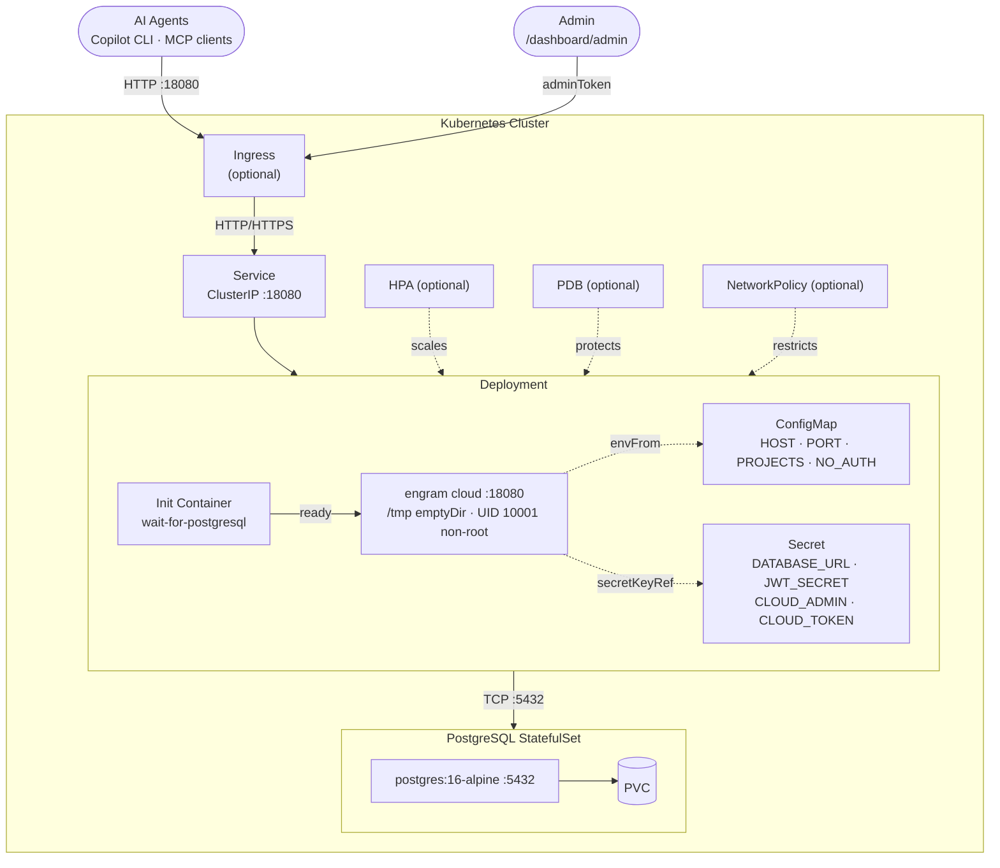

# helm-engram

> Community-maintained Helm chart for **[Engram Cloud](https://github.com/Gentleman-Programming/engram)** —
> the AI-powered persistent memory server that lets LLM agents share context and observations across
> sessions and team members.

[](https://artifacthub.io/packages/search?repo=helm-engram)
[](https://github.com/devops-ia/helm-engram/actions/workflows/helm-lint-test.yml)
[](LICENSE)

---

## What is this repository?

This repo ships and maintains the `helm-engram/engram` Helm chart — one chart, one application.
It is **not** the upstream Engram application; for that see
[Gentleman-Programming/engram](https://github.com/Gentleman-Programming/engram).

The chart packages Engram Cloud for Kubernetes with:

- Internal PostgreSQL StatefulSet (no external Helm repo needed)
- Horizontal Pod Autoscaler and PodDisruptionBudget
- Optional NetworkPolicy
- Flexible secret management (chart-managed, `existingSecret`, ESO, Sealed Secrets)
- Full test suite via `helm-unittest` (99 tests)
- Automated version tracking via UpdateCLI

---

## Architecture



---

## Quick Start

```bash
helm repo add helm-engram https://devops-ia.github.io/helm-engram
helm repo update

helm install engram helm-engram/engram \
  --set engram.jwtSecret="change-me-in-production" \
  --set engram.allowedProjects="my-project" \
  --set postgresql.auth.password="change-me"
```

For full installation options, authentication modes, environment variables reference, and all
chart values — see the **[chart documentation](charts/engram/README.md)** or the
[ArtifactHub page](https://artifacthub.io/packages/search?repo=helm-engram).

---

## Repository Structure

```
helm-engram/
├── charts/engram/          # The Helm chart
│   ├── Chart.yaml
│   ├── values.yaml         # Annotated defaults (source of truth for all config)
│   ├── values.schema.json  # JSON Schema validation
│   ├── templates/          # Kubernetes manifest templates
│   ├── tests/              # helm-unittest test suites (99 tests)
│   ├── ci/                 # CI values files (minimal, full, ingress)
│   └── README.md           # Chart reference — auto-generated by helm-docs
├── .github/
│   ├── workflows/          # CI: lint+test, release, version check
│   └── updatecli/          # Automated upstream version tracking
├── TESTING.md              # Local development & testing guide
└── CONTRIBUTING.md         # Contribution guidelines
```

---

## Development

See [TESTING.md](TESTING.md) for the full local development workflow. Quick reference:

```bash
# Lint
npm run lint                  # helm lint charts/engram
npm run lint:full             # lint with full CI values

# Unit tests (99 tests, 9 suites)
npm run test

# Template smoke tests
npm run template              # minimal values
npm run template:full         # all features enabled
npm run template:ingress      # ingress with TLS

# Regenerate charts/engram/README.md from README.md.gotmpl
npm run docs
```

Install the `helm-unittest` plugin once:

```bash
helm plugin install https://github.com/helm-unittest/helm-unittest --verify=false
```

---

## Automated Version Tracking

[UpdateCLI](https://www.updatecli.io/) monitors
[Gentleman-Programming/engram releases](https://github.com/Gentleman-Programming/engram/releases)
and opens automated PRs to bump `image.tag`, `Chart.yaml appVersion`, and `Chart.yaml version`.

Pipeline: `.github/updatecli/helm-appversion.yaml`

---

## Contributing

1. Fork → feature branch (`feat/my-feature`)
2. Change chart templates and/or values
3. Add or update tests in `charts/engram/tests/`
4. Run `npm run test && npm run lint`
5. Open a Pull Request — CI runs lint + unit tests + kind install automatically

See [CONTRIBUTING.md](CONTRIBUTING.md) for details.

---

## Links

| | |
|--|--|
| Engram upstream | <https://github.com/Gentleman-Programming/engram> |
| ArtifactHub | <https://artifacthub.io/packages/search?repo=helm-engram> |
| Chart reference | [charts/engram/README.md](charts/engram/README.md) |
| UpdateCLI | <https://www.updatecli.io/> |

## License

MIT — see [LICENSE](LICENSE).
